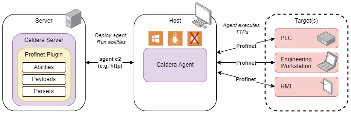

# Profinet
Profinet Protocol Threat Emulation Tooling

v1.0 released 8 Dec 2023
Mapped to ATT&CK for ICS [v14](https://attack.mitre.org/resources/updates/updates-october-2023/)

## Overview
The Profinet plugin provides __7__ unique abilities specific to the Profinet protocol. This is accomplished not through exploitation, but rather by leveraging native functionality within the protocol. The specification for the Profinet protocol is available for purchase from [profibus.com](https://www.profibus.com/download/profinet-specification).

Currently this plugin provides coverage for functions within the __Profinet Discovery and Basic Configuration Protocol__ (DCP) service. DCP supports configuration of Profinet devices via link-layer communications. Profinet devices typically use DCP on system start-up to identify network addresses of target endpoints.

The following table outlines MITRE ATT&CK for ICS coverage provided by the Profinet plugin:

|Discovery|Impair Process Control|
|:--|:--|
|Remote System Information Discovery|Unauthorized Command Message|
Remote System Discovery| |

### Ability Overview Tables
The following table(s) list each plugin ability by their corresponding tactic.

#### Discovery Abilities
|Name|Tactic|Technique|Technique ID|
|:--|:--|:--|:--|
|[Profinet DCP Identify](#profinet-dcp-identify)|Discovery|Remote System Discovery|T0846|
|[Profinet DCP Identify All](#profinet-dcp-identify-all)|Discovery|Remote System Discovery|T0846|
|[Profinet DCP Get-Name](#profinet-dcp-get-name)|Discovery|Remote System Information Discovery|T0888|
|[Profinet DCP Get-IP](#profinet-dcp-get-ip)|Discovery|Remote System Information Discovery|T0888|

#### Impair Process Control Abilities
|Name|Tactic|Technique|Technique ID|
|:--|:--|:--|:--|
|[Profinet DCP Set-Name](#profinet-dcp-set-name)|Impair Process Control|Unauthorized Command Message|T0855|
|[Profinet DCP Signal](#profinet-dcp-signal)|Impair Process Control|Unauthorized Command Message|T0855|
|[Profinet DCP Set-IP](#profinet-dcp-set-ip)|Impair Process Control|Unauthorized Command Message|T0855|


## Architecture
This section describes the main components of the plugin and how they interface.

### Block Diagram


The Profinet plugin exposes several new protocol specific abilities to your Caldera instance. The abilities are executed from a host running a Caldera agent via the corresponding payload. Abilities must target devices that support the Profinet protocol to achieve the described effects. Profinet DCP is a link-layer protocol that uses hardware addressing. For this reason, your Caldera Agent should be located on the same physical network as your target.

### Payloads
The Profinet plugin includes 2 distinct payloads that implement the abilities; each payload is described in detail below.

- `dcp_utility.exe`: &emsp; Windows CLI enabling Profinet DCP threat emulation actions
  - Compatible with Win32
  - Compiled with Windows 10 v21H2, Python version 3.8.10, Pyinstaller 6.2.0

- `dcp_utility`: &emsp; Linux CLI enabling Profinet DCP threat emulation actions
  - Compatible with Linux
  - Compiled with Ubuntu 22.04.2 LTS, Python version 3.8-dev, Pyinstaller 6.2.0

### Libraries
The following libraries were used to build the Profinet payloads:  

|Library|Version|License|
|:--|:--|:--|
|pnio_dcp|[v1.1.6](https://gitlab.com/pyshacks/pnio_dcp/-/tree/v1.1.6?ref_type=tags)|[MIT](https://gitlab.com/pyshacks/pnio_dcp/-/blob/v1.1.6/LICENSE.md?ref_type=tags)|

## Usage
This section describes how to intially deploy and execute the abilities present within the Profinet Plugin. 

### Requirements
- All abilities require the Caldera agent to have privileged access (i.e. root/admin). 
- On Windows, Npcap or WinPcap drivers must be installed on the Caldera agent host.

### Deployment
1. Identify the target system you would like to communicate with via the Profinet protocol.
2. Identify a viable host for the Caldera agent that will be sending Profinet messages to the target system.
3. Deploy the Caldera agent to the viable host.
4. Run a combination of the Profinet plugin abilities to achieve the desired effect.

*Reference the Caldera training plugin for a step-by-step tutorial on how to deploy an agent and run abilities via an operation.*

### Abilities
#### Profinet DCP Identify
Profinet DCP 
(Service ID: 0x05=Identify, Service Type: 0x00=Request, Option: 0xFF=ALL, Suboption: 0xFF=ALL)

Sends a Profinet DCP Identify request to a target device specified by MAC address to retrieve additional device information.
  

__Usage:__  
linux: (sh)  
```sh
./dcp_utility id_one #{dcp.target.mac}
```  

windows: (psh, cmd)  
```powershell
.\dcp_utility.exe id_one #{dcp.target.mac}
```

__Facts:__  
- `dcp.target.mac`: MAC address of target (default: aa:bb:cc:dd:ee:ff)

__Additional Command Line Options:__  
- `--host`:&nbsp; source IP address used by utility (optional, default: host primary)
- `--timeout`:&nbsp; how long to wait for response messages in seconds (optional, default: 10s)
<hr>

#### Profinet DCP Identify All
Profinet DCP 
(Service ID: 0x05=Identify, Service Type: 0x00=Request, Option: 0xFF=ALL, Suboption: 0xFF=ALL)

Broadcasts a Profinet DCP Identify All request to discover devices on the local subnet.   

__Usage:__  
linux: (sh)  
```sh
./dcp_utility id_all
```  

windows: (psh, cmd)  
```powershell
.\dcp_utility.exe id_all
```  

__Facts:__  
- `none`

__Additional Command Line Options:__  
- `--host`:&nbsp; source IP address used by utility (optional, default: host primary)
- `--timeout`:&nbsp; how long to wait for response messages in seconds (optional, default: 10s)
<hr>

#### Profinet DCP Get-Name
Profinet DCP 
(Service ID: 0x03=Get, Service Type: 0x00=Request, Option: 0x02=Device properties, Suboption: 0x02=Station name)

Requests the name of a target device specified by MAC address using Profinet DCP.   
  
__Usage:__  
linux: (sh)  
```sh
./dcp_utility get_name #{dcp.target.mac}
```  

windows: (psh, cmd)  
```powershell
.\dcp_utility.exe get_name #{dcp.target.mac}
```  

__Facts:__  
- `dcp.target.mac`: MAC address of target (default: aa:bb:cc:dd:ee:ff)

__Additional Command Line Options:__  
- `--host`:&nbsp; source IP address used by utility (optional, default: host primary)
- `--timeout`:&nbsp; how long to wait for response messages in seconds (optional, default: 10s)
<hr>

#### Profinet DCP Get-IP
Profinet DCP 
(Service ID: 0x03=Get, Service Type: 0x00=Request, Option: 0x01=IP, Suboption: 0x02=IP parameter)

Requests the IP address of a target device specified by MAC address using Profinet DCP.    
  
__Usage:__  
linux: (sh)  
```sh
./dcp_utility get_ip #{dcp.target.mac}
```
windows: (psh, cmd)  
```powershell
.\dcp_utility.exe get_ip #{dcp.target.mac}
```  

__Facts:__  
- `dcp.target.mac`: MAC address of target (default: aa:bb:cc:dd:ee:ff)

__Additional Command Line Options:__  
- `--host`:&nbsp; source IP address used by utility (optional, default: host primary)
- `--timeout`:&nbsp; how long to wait for response messages in seconds (optional, default: 10s)
<hr>

#### Profinet DCP Set-Name
Profinet DCP 
(Service ID: 0x04=Set, Service Type: 0x00=Request, Option: 0x02=Device properties, Suboption: 0x02=Station name)

Sets the name of a target device specified by MAC address.   
  
__Usage:__  
linux: (sh)  
```sh
./dcp_utility set_name #{dcp.target.mac} #{dcp.target.name} 
```  

windows: (psh, cmd)  
```powershell
.\dcp_utility.exe set_name #{dcp.target.mac} #{dcp.target.name} 
```  

__Facts:__  
- `dcp.target.mac`: MAC address of target (default: aa:bb:cc:dd:ee:ff)
- `dcp.target.name`: New name for target (default: stationname)

__Additional Command Line Options:__  
- `--host`:&nbsp; source IP address used by utility (optional, default: host primary)
- `--timeout`:&nbsp; how long to wait for response messages in seconds (optional, default: 10s)
<hr>

#### Profinet DCP Signal
Profinet DCP 
(Service ID: 0x04=Set, Service Type: 0x00=Request, Option: 0x05=Control, Suboption: 0x03=Signal)

Request target device specified by MAC address to flash its LEDs for local identification.     
  
__Usage:__  
linux: (sh)  
```sh
./dcp_utility blink #{dcp.target.mac}
```  

windows: (psh, cmd)  
```powershell
.\dcp_utility.exe blink #{dcp.target.mac}
```  

__Facts:__  
- `dcp.target.mac`: MAC address of target (default: aa:bb:cc:dd:ee:ff)

__Additional Command Line Options:__  
- `--host`:&nbsp; source IP address used by utility (optional, default: host primary)
- `--timeout`:&nbsp; how long to wait for response messages in seconds (optional, default: 10s)
<hr>

#### Profinet DCP Set-IP
Profinet DCP 
(Service ID: 0x04=Set, Service Type: 0x00=Request, Option: 0x01=IP, Suboption: 0x02=IP parameter)

Sets the network configuration (IP address, subnet mask, gateway) of a target device specified by MAC address.  
  
__Usage:__  
linux: (sh)  
```sh
./dcp_utility set_ip #{dcp.target.mac} #{dcp.target.ip} #{dcp.target.subnetmask} #{dcp.target.gateway} 
```  

windows: (psh, cmd)  
```powershell
.\dcp_utility.exe set_ip #{dcp.target.mac} #{dcp.target.ip} #{dcp.target.subnetmask} #{dcp.target.gateway}
```  

__Facts:__  
- `dcp.target.mac`: MAC address of target (default: aa:bb:cc:dd:ee:ff)
- `dcp.target.ip`: New IP address configuration for target (default: 127.0.0.1)
- `dcp.target.subnetmask`: New subnet mask configuration for target (default: 0.0.0.255)
- `dcp.target.gateway`: New gateway address configuration for target (default: 127.0.0.100)

__Additional Command Line Options:__  
- `--host`:&nbsp; source IP address used by utility (optional, default: host primary)
- `--timeout`:&nbsp; how long to wait for response messages in seconds (optional, default: 10s)

### Source Code
The source code for the Profinet plugin can be found inside this plugin's [src directory](/src/).

### Copyright Notice
Profinet® is a registered trademark of PROFIBUS Nutzerorganisation, Haid-und-Neu-Straße 7 76131 Karlsruhe FED REP GERMANY.

This Caldera plugin is named "Profinet" in order to describe its scope and purpose. This plugin is not produced by or affiliated with PROFIBUS Nutzerorganisation.